## FortiClient VPN 客户端

访问公司网络所需的 VPN 客户端。

下载页面：https://www.forticlient.com/downloads ，目前没有提供给 Ubuntu 20.04 的 repo 安装方法，所以直接下载 deb 包安装：

```bash
wget https://filestore.fortinet.com/forticlient/downloads/FortiClientFullVPNInstaller_6.4.0.0851.deb
sudo dpkg -i FortiClientFullVPNInstaller_6.4.0.0851.deb
```


## EasyConnect VPN 客户端

公司 VPN 客户端。目前暂时不支持 Ubuntu 20.04，先从百度网盘下载库文件：https://wws.lanzous.com/b01nmd4sh ，密码：76yn

```bash
wget http://download.sangfor.com.cn/download/product/sslvpn/pkg/linux_01/EasyConnect_x64.deb
sudo dpkg -i EasyConnect_x64.deb

# 解压下载的 4 个 deb 包
dpkg -X libpango-1.0-0_1.42.4-7_amd64.deb ./libpango
dpkg -X libpangoairo-1.0-0_1.42.4-7_amd64.deb ./libpango
dpkg -X libpangocairo-1.0-0_1.42.4-7_amd64.deb ./libpango
dpkg -X libpangoft2-1.0-0_1.42.4-7_amd64.deb ./libpango

# 拷贝解压出来的库文件到安装后的软件目录
cd libpango/usr/lib/x86_64-linux-gnu/
sudo cp * /usr/share/sangfor/EasyConnect/

# 验证库文件版本
cd /usr/share/sangfor/EasyConnect/
ldd EasyConnect | grep pango
	libpangocairo-1.0.so.0 => /usr/share/sangfor/EasyConnect/./libpangocairo-1.0.so.0 (0x00007ff0d63ca000)
	libpango-1.0.so.0 => /usr/share/sangfor/EasyConnect/./libpango-1.0.so.0 (0x00007ff0d6233000)
	libpangoft2-1.0.so.0 => /usr/share/sangfor/EasyConnect/./libpangoft2-1.0.so.0 (0x00007ff0d4588000)
```

然后便可以正常打开 EasyConnect。可能会遇到闪退问题，此时在登录进度条大概70%左右执行命令

```bash
sudo /bin/bash /usr/share/sangfor/EasyConnect/resources/shell/sslservice.sh
```

可以解决登录几秒后闪退问题。


## Docker

容器化

### [docker 安装](https://docs.docker.com/engine/install/ubuntu/)：
```bash
sudo apt-get remove docker docker-engine docker.io containerd runc
sudo apt-get update
sudo apt-get install \
    apt-transport-https \
    ca-certificates \
    curl \
    gnupg-agent \
    software-properties-common
curl -fsSL https://download.docker.com/linux/ubuntu/gpg | sudo apt-key add -

sudo add-apt-repository \
   "deb [arch=amd64] https://download.docker.com/linux/ubuntu \
   $(lsb_release -cs) \
   stable"
   
sudo apt-get update
sudo apt-get install docker-ce docker-ce-cli containerd.io

sudo usermod -aG docker $USER
```

### [docker-compose 安装](https://docs.docker.com/compose/install/)：
```bash
sudo curl -L "https://github.com/docker/compose/releases/download/1.28.2/docker-compose-$(uname -s)-$(uname -m)" -o /usr/local/bin/docker-compose
```

### podman 安装：

参考资料：[Install and Use Podman](https://www.vultr.com/docs/how-to-install-and-use-podman-on-ubuntu-20-04)

```bash
. /etc/os-release
sudo sh -c "echo 'deb https://download.opensuse.org/repositories/devel:/kubic:/libcontainers:/stable/xUbuntu_${VERSION_ID}/ /' > /etc/apt/sources.list.d/devel:kubic:libcontainers:stable.list"
curl -L https://download.opensuse.org/repositories/devel:/kubic:/libcontainers:/stable/xUbuntu_${VERSION_ID}/Release.key | sudo apt-key add -
sudo apt-get update
sudo apt-get install podman skopeo buildah
```


## C & C++

目前 gcc 和 g++ 在 Ubuntu 上的版本是 9.3.0

```bash
sudo apt-get install build-essential

gcc --version
gcc (Ubuntu 9.3.0-17ubuntu1~20.04) 9.3.0
Copyright (C) 2019 Free Software Foundation, Inc.
This is free software; see the source for copying conditions.  There is NO
warranty; not even for MERCHANTABILITY or FITNESS FOR A PARTICULAR PURPOSE.
```


## Nodejs

nodejs 开发

```bash
sudo apt-get install nodejs npm yarnpkg
sudo ln -s /usr/bin/yarnpkg /usr/bin/yarn

node --version
v10.19.0
```

如果希望安装更新版本的：

```bash
sudo apt purge nodejs npm
curl -sL https://deb.nodesource.com/setup_15.x | sudo bash -
sudo apt update
sudo apt install nodejs
```


## JDK

目前最新的长期支持版本（LTS）是 11，所以 `default-jdk` 的版本就是 11

```bash
sudo apt-get install default-jdk

java --version
openjdk 11.0.9.1 2020-11-04
OpenJDK Runtime Environment (build 11.0.9.1+1-Ubuntu-0ubuntu1.20.04)
OpenJDK 64-Bit Server VM (build 11.0.9.1+1-Ubuntu-0ubuntu1.20.04, mixed mode, sharing)
```

Ubuntu 官方安装的是 OpenJDK，如果想要安装 Oracle 的 JDK，去 Oracle 官方网站下载：https://www.oracle.com/java/technologies/javase-downloads.html


## Golang

Go 语言可以通过 apt 来安装，但 Ubuntu 上的版本太老了，所以还是从官网下载最新版

```bash
wget https://golang.org/dl/go1.15.7.linux-amd64.tar.gz
sudo tar -C /usr/local -xzf go1.15.7.linux-amd64.tar.gz

# 或者 sudo snap install go 安装 15.6 版

sudo sh -c 'echo "export PATH=\$PATH:/usr/local/go/bin" >> /etc/profile'
source /etc/profile

go version
go version go1.15.7 linux/amd64
```


## Python

现在基本都开始用 Python 3 了，Ubuntu 官方也缺省支持安装 Python 3

```bash
sudo apt-get install python3 python3-pip

python --version
Python 3.8.5
```


## Rust

为了下载速度，先设置国内镜像：

```bash
# 用于更新 toolchain
echo "export RUSTUP_DIST_SERVER=https://mirrors.ustc.edu.cn/rust-static" >> ~/.profile
# 用于更新 rustup
echo "export RUSTUP_UPDATE_ROOT=https://mirrors.ustc.edu.cn/rust-static/rustup" >> ~/.profile
```

然后执行安装脚本：

```bash
curl --proto '=https' --tlsv1.2 -sSf https://sh.rustup.rs | sh

rustup update

rustc --version
rustc 1.49.0 (e1884a8e3 2020-12-29)
```


## VS Code

下载：https://code.visualstudio.com/Download

```bash
wget https://code.visualstudio.com/sha/download?build=stable&os=linux-deb-x64
sudo dpkg -i code_1.52.1-1608136922_amd64.deb
```


## WindTerm

部分开源跨平台 SSH 客户端及连接管理器：https://github.com/kingToolbox/WindTerm

```bash
tar -xzvf WindTerm_2.1.0_Linux_Portable.tar.gz && cd ./WindTerm_2.1.0 && chmod +x ./WindTerm && ./WindTerm
```

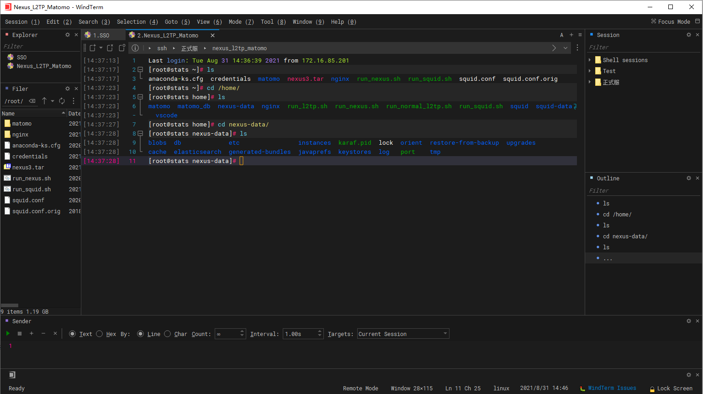


注意一段时间没有操作，它会自动锁屏。因为我一般设置了系统自动锁屏，所以可以把这个特性关掉。修改 `WindTerm_install_path/profiles/default.v10/user.config` 文件，加上

```ini
"application.lockScreenTimeout": false
```


## Electerm

开源跨平台 SSH 客户端及连接管理器：https://github.com/electerm/electerm

```
wget https://github.com/electerm/electerm/releases/download/v1.11.11/electerm-1.11.11-linux-amd64.deb
sudo dpkg -i electerm-1.11.11-linux-amd64.deb
```

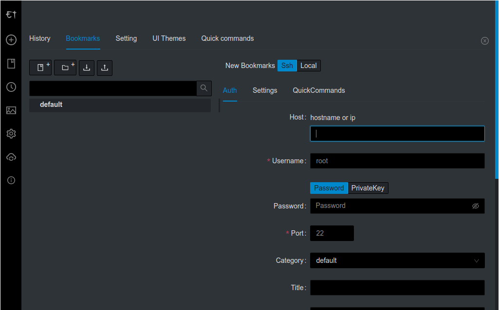


## Remmina

Ubuntu 缺省安装了这个软件，可用于管理 Windows 远程桌面，也可用于 VNC、SSH 会话的管理。


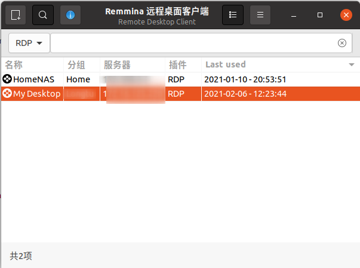


## Insomnia

可以替代 PostMan 的免费 API 开发测试工具：https://insomnia.rest/

建议下载安装包安装。

```bash
sudo dpkg -i Insomnia.Core-2020.5.2.deb
```

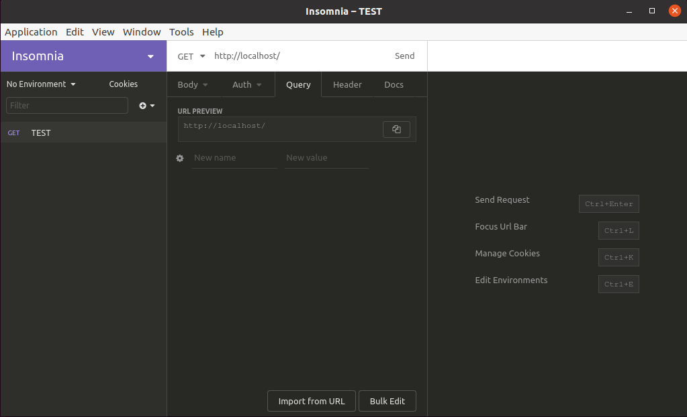


## Typora

跨平台 Markdown 撰写利器

```bash
wget -qO - https://typora.io/linux/public-key.asc | sudo apt-key add -
sudo add-apt-repository 'deb https://typora.io/linux ./'
sudo apt-get update
sudo apt-get install typora
```

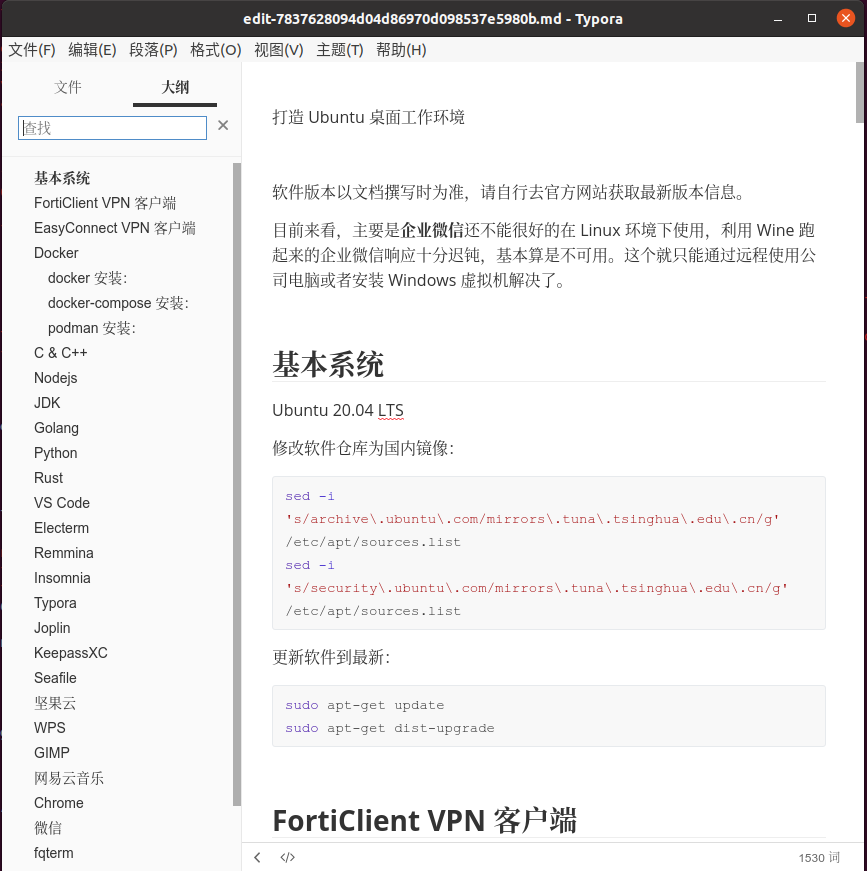


## Joplin

开源的笔记软件，可以通过文件、OneDrive、NextCloud、WebDav 等同步，支持各种平台，支持笔记文件加密，提供 Web clipper 来转换网页为 Markdown 文章……我已经弃有道笔记换这个了。

另外 Ctrl + E 就可以用 Typora 作为外部编辑器来撰写笔记了。官网：https://joplinapp.org/ 。下面的安装方式可能需要科学上网，推荐[自己编译](https://github.com/laurent22/joplin/blob/dev/BUILD.md) 。

```bash
wget -O - https://raw.githubusercontent.com/laurent22/joplin/dev/Joplin_install_and_update.sh | bash
```

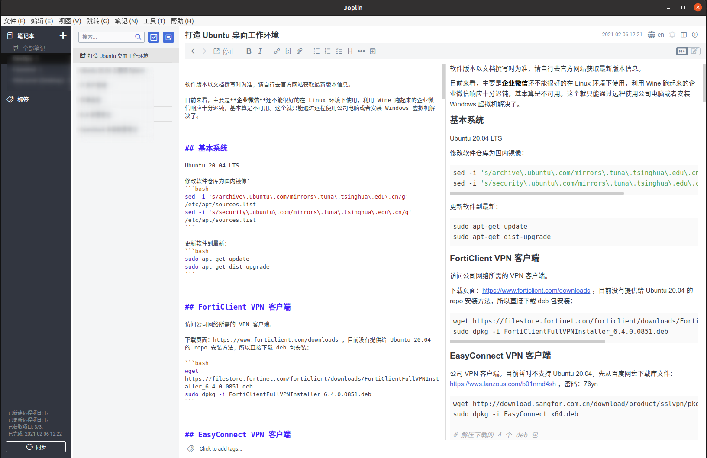


## KeepassXC

跨平台密码管理器、生成器

```bash
sudo apt-get install keepassxc
```

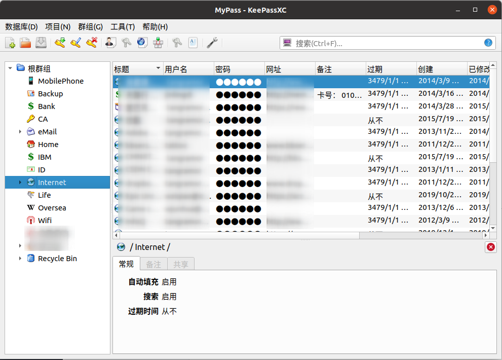


## Seafile

跨平台私有云盘客户端

```bash
sudo bash -c "echo 'deb [arch=amd64 signed-by=/usr/share/keyrings/seafile-keyring.asc] https://linux-clients.seafile.com/seafile-deb/focal/ stable main' > /etc/apt/sources.list.d/seafile.list"
sudo apt-get update
sudo apt-get install -y seafile-gui
```

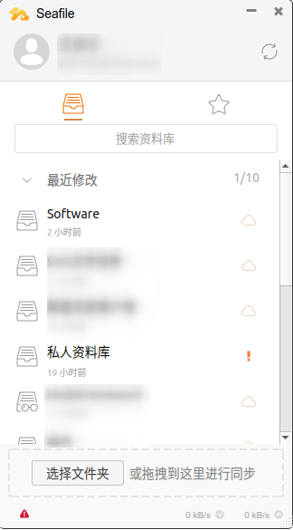


## 坚果云

个人同步一些小文件的云盘。下载页面：https://www.jianguoyun.com/s/downloads/linux

```bash
wget https://www.jianguoyun.com/static/exe/installer/ubuntu/nautilus_nutstore_amd64.deb
sudo dpkg -i nautilus_nutstore_amd64.deb
sudo apt-get install -f
```

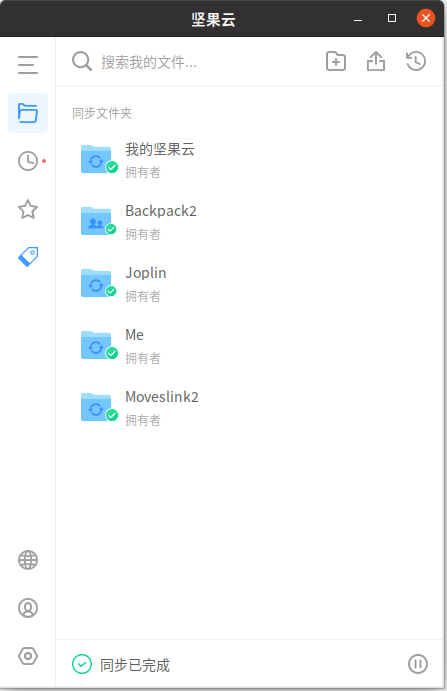


## WPS

Office 在 Linux 下的完美替代：https://www.wps.cn/product/wpslinux

```bash
wget https://wdl1.cache.wps.cn/wps/download/ep/Linux2019/10161/wps-office_11.1.0.10161_amd64.deb
sudo dpkg -i wps-office_11.1.0.10161_amd64.deb
```

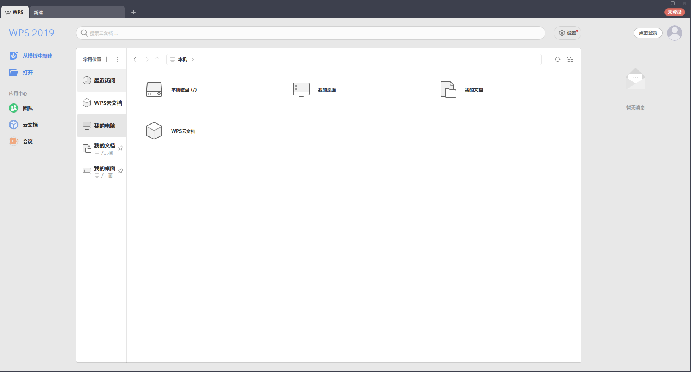


## FlameShot 火焰截图

截图工具

```bash
sudo apt-get install flameshot
```

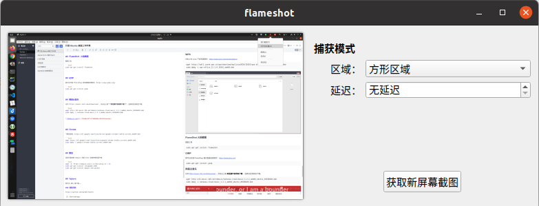


## GIMP

跨平台开源 PhotoShop 替代图像处理软件：https://www.gimp.org/

```bash
sudo apt-get install gimp
```


## 网易云音乐

访问 https://music.163.com/#/download ，点击右上角“**其他操作系统客户端**“，选择对应安装包下载。

```bash
wget http://d1.music.126.net/dmusic/netease-cloud-music_1.2.1_amd64_ubuntu_20190428.deb
sudo dpkg -i netease-cloud-music_1.2.1_amd64_ubuntu_20190428.deb
```


## Chrome

下载安装包：https://dl.google.com/linux/direct/google-chrome-stable_current_amd64.deb

```bash
wget https://dl.google.com/linux/direct/google-chrome-stable_current_amd64.deb
sudo dpkg -i google-chrome-stable_current_amd64.deb
```


## 微信

目前只能安装 Deepin 利用 Wine 封装的微信客户端

```bash
wget -O- https://deepin-wine.i-m.dev/setup.sh | sh
sudo apt-get install libjpeg62:i386
sudo apt-get install deepin.com.wechat
```


## fqterm

跨平台 BBS 客户端……

### 获取代码

https://github.com/mytbk/fqterm

```bash
git clone https://github.com/mytbk/fqterm.git
```

### 安装所需 Qt 库并编译安装

```bash
sudo apt install qt5-default qttools5-dev qtmultimedia5-dev qtscript5-dev
# 假设FQTerm源码目录为fqterm
mkdir build
cd build
cmake ../fqterm
make
# 以root身份安装，以下用sudo获取root权限
sudo make install
```

### 添加桌面快捷方式

拷贝 `/usr/local/share/applications/fqterm.desktop` 文件到 `~/桌面/`

然后在桌面鼠标右键点击 fqterm.desktop 文件，选择“**允许启动**”，这时这个文件的图表和名称都变成了 fqterm 的，双击可以启动。可以在左侧stock栏的图标上鼠标右键点击，选择“**添加到收藏夹**”。


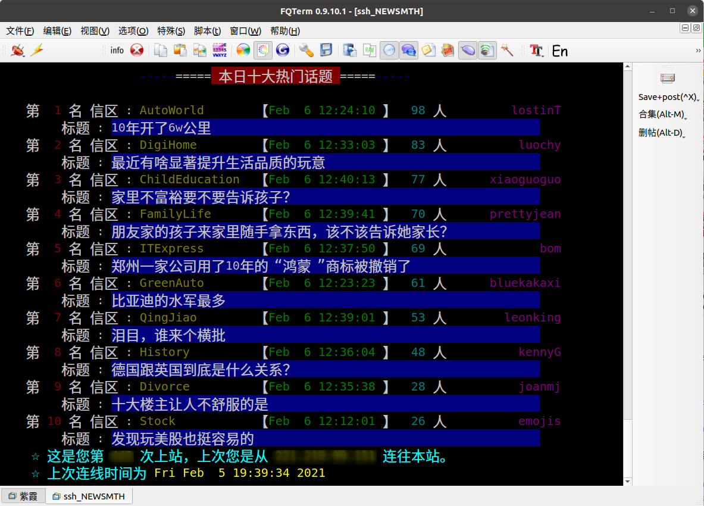


