## 铜豌豆 Linux 软件

铜豌豆 Linux 是基于 Debian 的 Linux 中文 开源操作系统。官网：https://www.atzlinux.com 。这里主要利用它的软件源安装一些字体。

软件包列表：https://www.atzlinux.com/allpackages.htm

添加软件源：

```bash
wget -c -O atzlinux-archive-keyring_lastest_all.deb https://www.atzlinux.com/atzlinux/pool/main/a/atzlinux-archive-keyring/atzlinux-archive-keyring_lastest_all.deb
sudo apt -y install ./atzlinux-archive-keyring_lastest_all.deb
sudo dpkg --add-architecture i386
sudo apt update
```

安装**免费字体**：

```bash
sudo apt-get install -y fonts-cascadia-code fonts-cjk-cn-honglei fonts-cjk-cn-jiangxizhuokai \
	fonts-cjk-cn-slidechunfeng fonts-cjk-cn-slidexiaxing fonts-cjk-cn-slideqiuhong \
	fonts-cjk-cn-slideyouran fonts-cjk-zh-slidefu fonts-cjk-cn-youshebiaotihei \
	fonts-cjk-cn-youshehaoshenti fonts-cjk-cn-yrdzst fonts-cjk-zh-seto-xiaolai fonts-cjk-zh-iming \
	fonts-cjk-zh-jiangchengxieti fonts-cjk-zh-mengshen fonts-cjk-zh-qiji fonts-cjk-zh-yozai \
	fonts-sarasa-fixed-sc fonts-cjk-cn-acy fonts-cjk-cn-baotuxiaobaiti fonts-cjk-cn-huxiaobo-free \
	fonts-cjk-cn-pangmenzhengdao-free fonts-cjk-cn-zcool-free fonts-cjk-cn-sucaijishi-free \
	fonts-cjk-cn-liujianmaocao fonts-cjk-cn-longcang fonts-cjk-cn-mashanzheng \
	fonts-cjk-cn-zhimangxing fonts-cjk-cn-ztsj-baguettefont fonts-jetbrains-mono \
	fonts-cjk-cn-azppt fonts-cjk-cn-hcszt fonts-cjk-cn-lianmengqiyilushuaizhengruiheiti \
	fonts-cjk-cn-shoushuti fonts-cjk-tc-keshilu fonts-cjk-zh-dotted-songti \
	fonts-cjk-zh-hanzi-pinyin fonts-cjk-zh-jasonhandwriting-max fonts-cjk-cn-muyao-free \
	fonts-cjk-cn-pinrushouxieti fonts-cjk-cn-xinye-nianti fonts-resource-han-rounded-cn \
	fonts-cjk-jp-aoyagireisyosimo2 fonts-adobe-source-han-cn fonts-cjk-tc-jasonhandwriting4 \
	fonts-max-cjkfonts fonts-cjk-jp-elmer fonts-cjk-jp-07reallyscaryinchotai \
	fonts-cns11643-shuowenjiezi fonts-babelstone-flags fonts-babelstone-xiangqi \
	fonts-cjk-zh-jiangchengyuehuti
```


## VirtualBox

Ubuntu 软件仓库已存在 VirtualBox，直接安装：

```bash
sudo apt-get install virtualbox vde2 virtualbox-guest-additions-iso
```


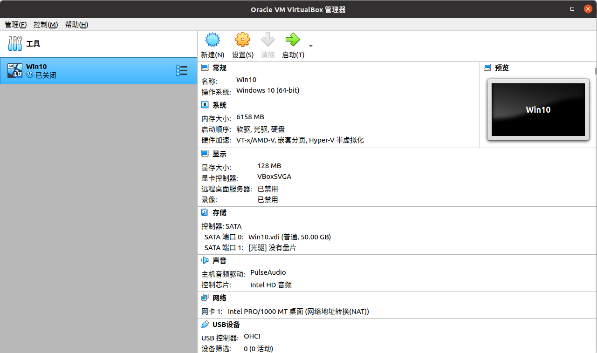


## xDroid

直接在 Linux 环境里运行 Android 应用的工具：https://www.linzhuotech.com/Product/download

### 安装

下载安装包后解压，然后运行解压目录里的 `install.sh` ，会有图形化的安装界面


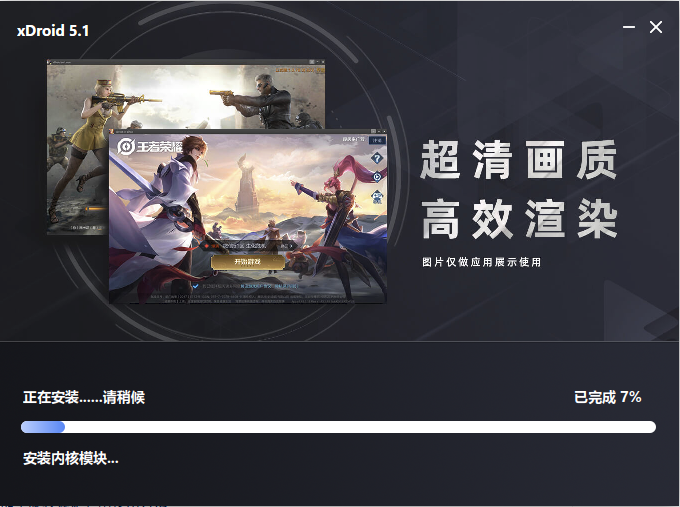


安装完成后会在桌面创建一个 `xDroid.desktop` 文件，我们去到桌面让它“**允许启动**”，这样就可以双击启动 xDroid 程序了。


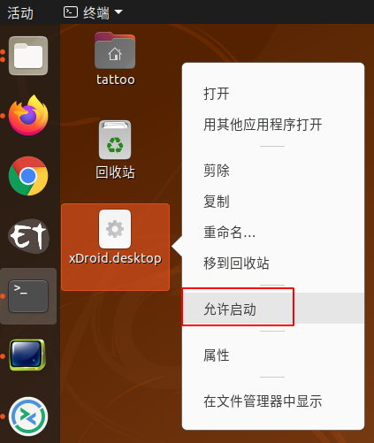


### 使用

xDroid 启动后会要求你登录它的应用商城。登录后就可以安装安卓应用了。


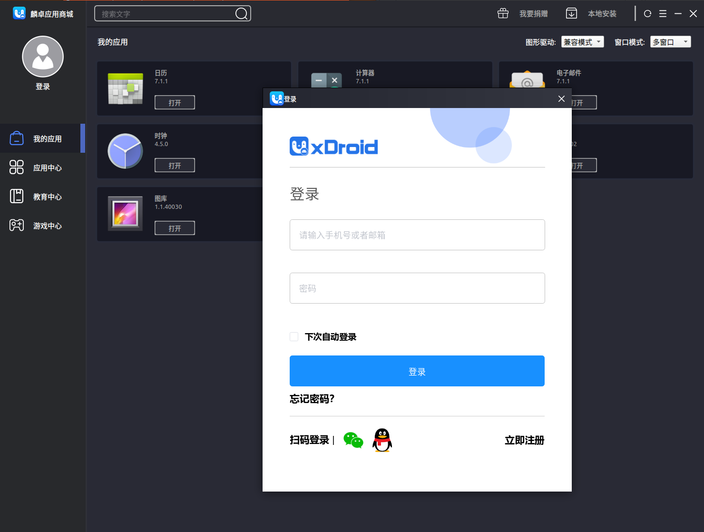

我尝试安装了企业微信，运行正常：


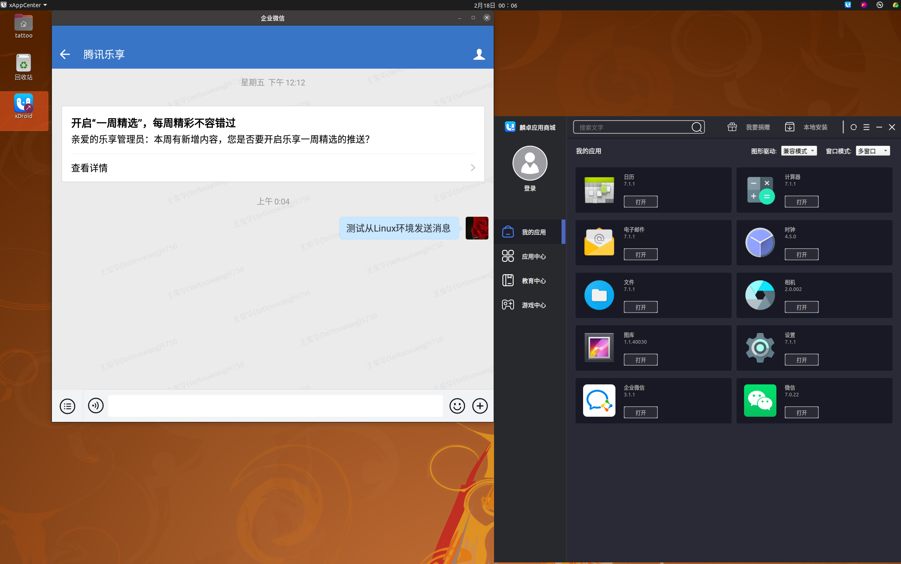


它还支持与宿主 Linux 环境共享目录，输出音频等等。


## GitAhead

虽然平时用 git 命令行和 VS Code 的插件就足以应付绝大多数开发时的 git 操作，但有时候还是想要一个更直观的图形化版本分支查看工具。

Mac 与 Windows 下比较好的 git 图形化工具 [SourceTree](https://www.sourcetreeapp.com/) 大概可以算一个，但支持 Linux 的工具要么是闭源，要么对免费版减功能，例如 [GitKraken](https://www.gitkraken.com/download)、 [SmartGit](https://www.syntevo.com/smartgit/download/)、[GitBlade](https://gitblade.com/) 之流；要么是只支持 Linux，例如 [Gitg](https://git-scm.com/downloads) 、[QGit](https://sourceforge.net/projects/qgit/)；要么功能比较弱，例如 [Git Gui](https://mirrors.edge.kernel.org/pub/software/scm/git/docs/git-gui.html)。不过我们还是能找到一款开源且支持 Linux、Windows 和 Mac 多平台的 git 图形化工具：**GitAhead**。

**官网**：https://gitahead.com/ ，**Github**：https://github.com/gitahead/gitahead

GitAhead 在 Windows 和 Mac 上的安装包都还是比较传统，但给 Linux 的是一个包含了压缩包的 shell 脚本。下载 GitAhead-[version].sh 后，把它放到一个当前用户有写入权限的目录，然后运行此脚本，它会在当前目录下创建 GitAhead 目录并解压所有文件到里面，同时自动创建快捷启动方式。当然也可以使用 `./GitAhead-2.6.3.sh --prefix=/home/tangramor/` 这样的方式指定安装目录。

这种安装方式比较方便的是卸载只需要删除安装目录即可，但也会留下遗留的快捷方式和图标，官方目前还没提供一个在 Linux 下更好的卸载方法。

安装好以后点击快捷启动图标运行 GitAhead，可以看到它支持克隆远程仓库、打开本地仓库、创建新仓库，也可以直接用 GitHub、Bitbucket、Beanstalk 或 GitLab 账户登录后选择远程仓库进行操作。


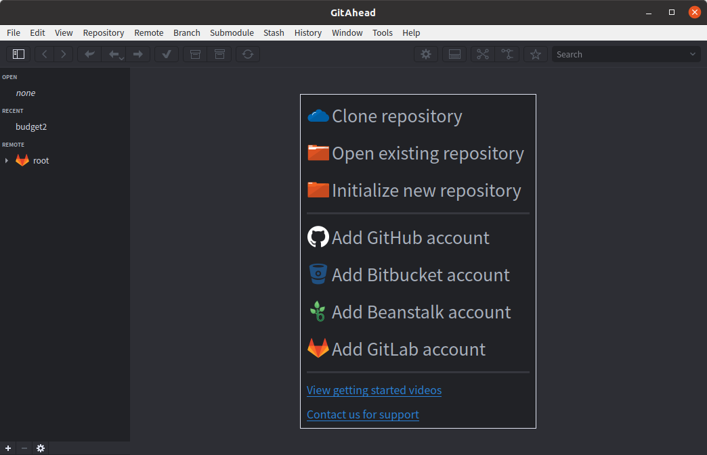


如果是自己部署的 GitLab 服务器，那么在添加账户界面需要展开 **Advanced** 选项填入自己服务器的 URL。注意用户的 Password 一栏填写的其实不是用户登录密码，而是需要去到 GitLab 服务器上生成用户的个人访问 token。

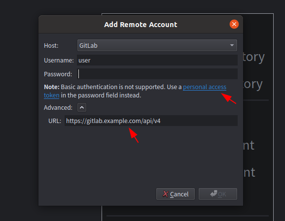


可以看到 GitAhead 对分支和历史支持得很漂亮：

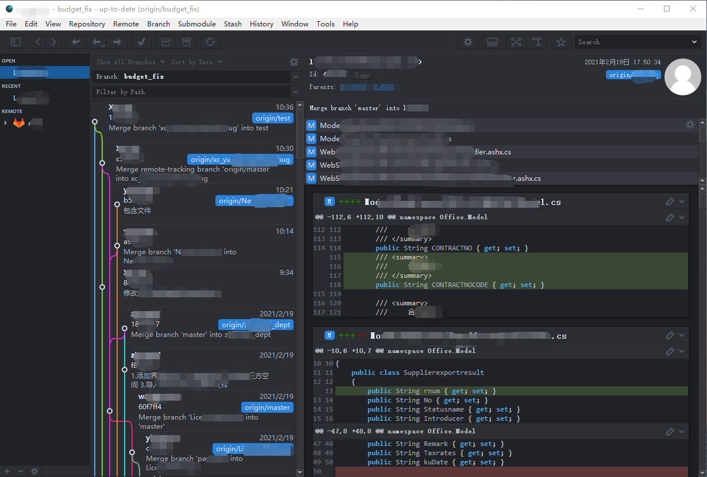


## Double Commander

Total Commander 的开源替代。官网：https://doublecmd.sourceforge.io 

安装可以下载 deb 包或者 [使用 openSUSE 的源](https://software.opensuse.org/download.html?project=home%3AAlexx2000&package=doublecmd-gtk)，也提供 [qt4](https://software.opensuse.org/download.html?project=home%3AAlexx2000&package=doublecmd-qt4) 和 [qt5](https://software.opensuse.org/download.html?project=home%3AAlexx2000&package=doublecmd-qt5) 安装源

```bash
echo 'deb http://download.opensuse.org/repositories/home:/Alexx2000/xUbuntu_20.04/ /' | sudo tee /etc/apt/sources.list.d/home:Alexx2000.list

curl -fsSL https://download.opensuse.org/repositories/home:Alexx2000/xUbuntu_20.04/Release.key | gpg --dearmor | sudo tee /etc/apt/trusted.gpg.d/home_Alexx2000.gpg > /dev/null

sudo apt update
sudo apt install doublecmd-gtk
```

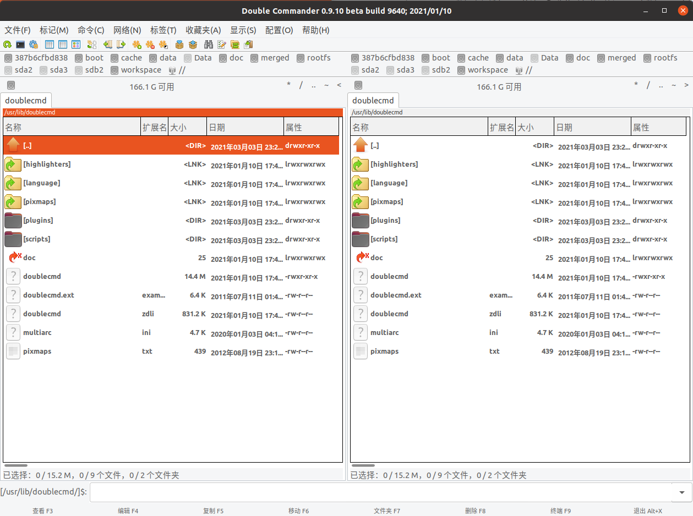


## 福昕 PDF 阅读器

官方下载：https://www.foxitsoftware.cn/downloads/

下载压缩包，解压缩后运行安装文件安装即可：

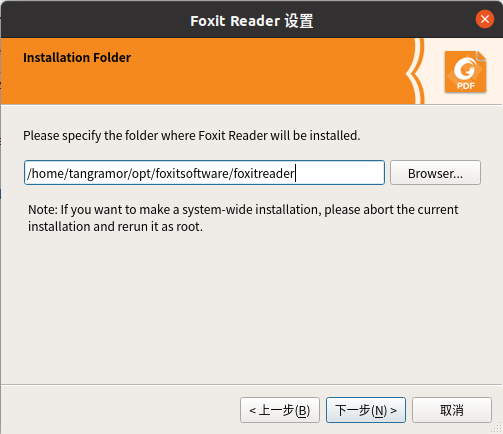

打开 PDF 文件的效果很不错：

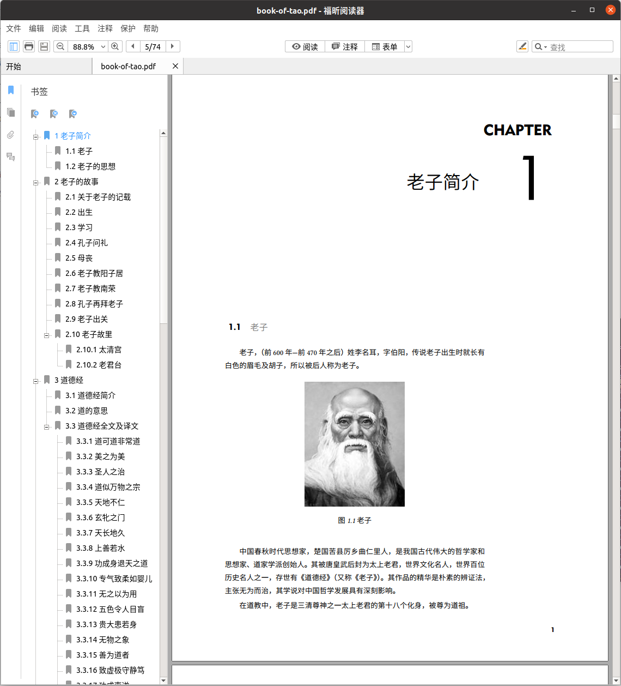


## EverNote 第三方客户端

Linux 上没有 EverNote 官方的客户端，但官方推荐了两个第三方做得不错的：Tusk ( https://github.com/klaussinani/tusk ) 和 NixNote2 ( https://github.com/baumgarr/nixnote2 )。个人感觉 Tusk 的 UI 更现代、清晰。


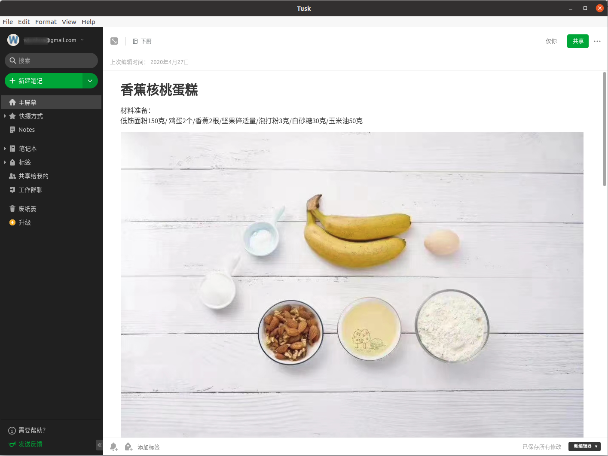


## Meld 文件对比

Linux 下面也可以买 BeyondCompare，但 Meld 其实绝大部分时间也够用了。

```bash
sudo apt install meld
```


## XnViewMP 看图软件

支持 Windows、Mac 和 Linux，虽然不是开源软件，但对个人免费。打开图片很快，也有很多分类、编辑的便利功能。

官网：https://www.xnview.com/en/xnviewmp/

安装：

```bash
wget https://download.xnview.com/XnViewMP-linux-x64.deb
sudo dpkg -i XnViewMP-linux-x64.deb
```


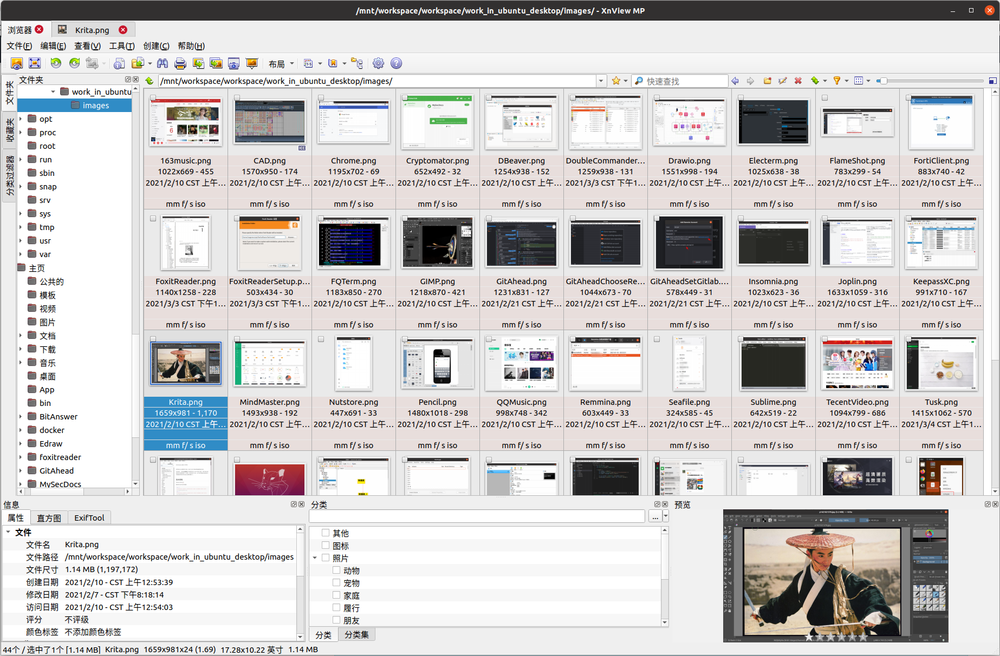


## digiKam 相册管理

开源的功能也很全面的图片相册管理软件。

```bash
sudo apt install digikam
```


## Kazam 录屏软件

录制屏幕操作的好帮手，也可以截取屏幕图片。

```bash
sudo apt install kazam
```


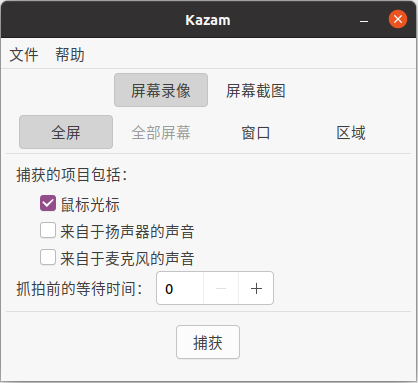


## Kdenlive 视频编辑

不比专业的视频编辑软件差多少，小视频用它足够了。

```bash
sudo apt install kdenlive
```


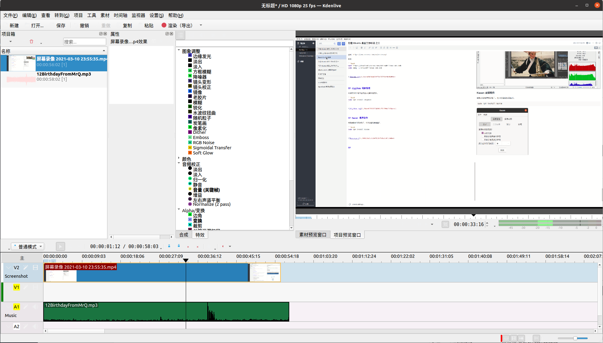


## 洛雪音乐助手

一个开源跨平台的在线音乐聚合播放器，几乎将国内各大平台都囊括进来了，还支持下载……

https://github.com/lyswhut/lx-music-desktop

```bash
wget https://github.com/lyswhut/lx-music-desktop/releases/download/v1.8.2/lx-music-desktop.v1.8.2.x64.deb
sudo dpkg -i lx-music-desktop.v1.8.2.x64.deb
```


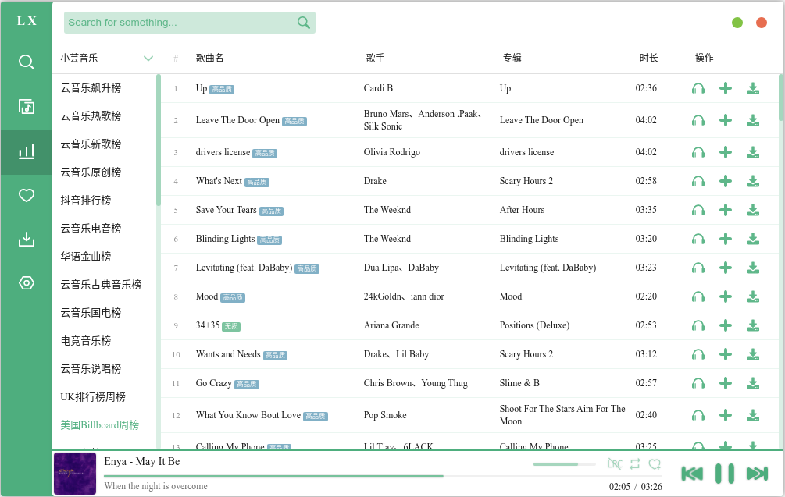